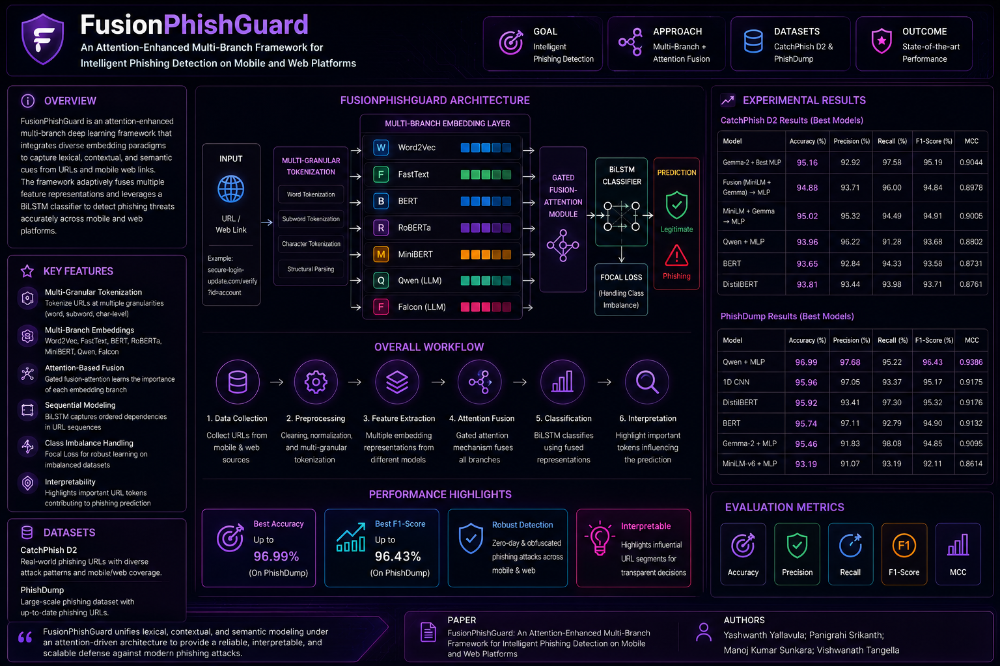
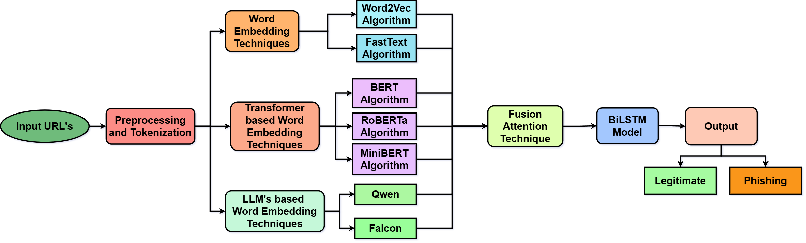
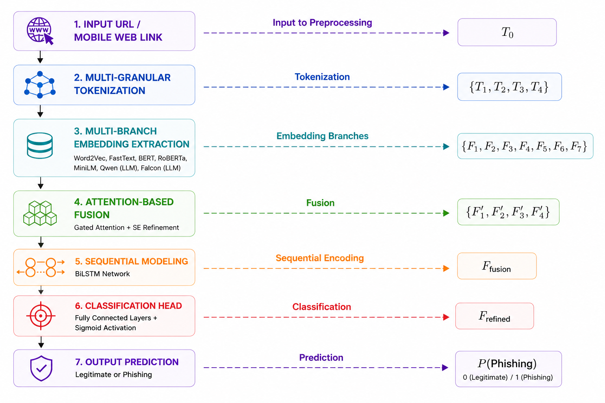

# FusionPhishGuard
Phishing detection, mobile and web security, attention mechanism, multi-branch deep learning, word embeddings, transformer, large language models (LLMs), BiLSTM, fusion framework.
To address these challenges, we propose FusionPhishGuard, an attention-enhanced multi-branch deep learning
framework designed for intelligent phishing detection across
mobile and web environments. The framework integrates multiple levels of representation—from raw lexical structures to
high-level semantic features—using adaptive attention-based
fusion to model complex relationships between URL tokens,
subwords, and contextual cues. 
<!-- ========================= BANNER ========================= -->

<p align="center">
  
</p>

<h1 align="center">FusionPhishGuard</h1>

<h3 align="center">
An Attention-Enhanced Multi-Branch Framework for Intelligent Phishing Detection on Mobile and Web Platforms
</h3>

<p align="center">
  
  
  
  
  
  
</p>

---

# Overview

FusionPhishGuard is an attention-enhanced multi-branch deep learning framework designed for intelligent phishing detection across mobile and web platforms.

The framework integrates:

- Multi-granular tokenization
- Transformer-based embeddings
- Large Language Model embeddings
- Attention-enhanced feature fusion
- Sequential BiLSTM modeling

to effectively detect modern phishing attacks, including:

- Obfuscated phishing URLs
- Brand impersonation attacks
- Mobile redirect phishing
- Cross-platform phishing campaigns
- Semantic deception attacks

---

# IEEE COMSNETS 2026 Acceptance

📌 Accepted at **IEEE COMSNETS 2026 (SysAI Track)**

### Paper Title

> **FusionPhishGuard: An Attention-Enhanced Multi-Branch Framework for Intelligent Phishing Detection on Mobile and Web Platforms**

---

# Authors

- **Yashwanth Yallavula**
- **Panigrahi Srikanth**
- **Manoj Kumar Sunkara**
- **Vishwanath Tangella**

---

# Key Highlights

- Multi-Branch Deep Learning Framework
- Attention-Based Adaptive Feature Fusion
- Multi-Granular URL Tokenization
- Transformer + LLM Hybrid Representation Learning
- BiLSTM Sequential Context Modeling
- Robust Cross-Platform Phishing Detection
- Strong Performance on Benchmark Datasets
- Interpretable Phishing Feature Learning

---

# Framework Architecture

<p align="center">
  
</p>

FusionPhishGuard combines heterogeneous embedding paradigms using an adaptive gated attention fusion mechanism.

The framework integrates:

| Branch | Purpose |
|---|---|
| Word2Vec | Lexical pattern learning |
| FastText | Character-level robustness |
| BERT | Contextual understanding |
| RoBERTa | Deep semantic encoding |
| MiniLM | Lightweight contextual modeling |
| Qwen | LLM semantic reasoning |
| Falcon | Large-scale language understanding |

The fused representations are processed through:

- Fusion Attention Layer
- Squeeze-and-Excitation Refinement
- BiLSTM Sequential Modeling
- Final Classification Network

---

# Experimental Pipeline

<p align="center">
  
</p>

The pipeline consists of:

1. URL Collection
2. Multi-Granular Tokenization
3. Embedding Extraction
4. Attention-Based Fusion
5. Sequential Context Modeling
6. Phishing Classification
7. Interpretation & Evaluation

---

# Datasets

## CatchPhish D2

- Real-world phishing URL dataset
- Includes obfuscated and deceptive URL patterns
- Balanced phishing and legitimate samples

## PhishDump

- Large-scale phishing URL corpus
- Mobile and web phishing links
- Real-world phishing campaigns

---

# Experimental Results

## CatchPhish Results

| Model | Accuracy | F1-Score | MCC |
|---|---|---|---|
| Gemma-2 + Best MLP | **95.16%** | **95.19%** | **0.9044** |
| Fusion (MiniLM + Gemma) | 94.88% | 94.84% | 0.8978 |
| Qwen + MLP | 93.96% | 93.68% | 0.8802 |
| DistilBERT | 93.81% | 93.71% | 0.8761 |
| BERT | 93.65% | 93.58% | 0.8731 |

---

## PhishDump Results

| Model | Accuracy | F1-Score | MCC |
|---|---|---|---|
| Qwen + MLP | **96.99%** | **96.43%** | **0.9386** |
| 1D CNN | 95.96% | 95.17% | 0.9175 |
| DistilBERT | 95.92% | 95.32% | 0.9176 |
| BERT | 95.74% | 94.90% | 0.9132 |
| Gemma-2 + MLP | 95.46% | 94.85% | 0.9095 |

---

FusionPhishGuard employs:

- Gated Additive Attention
- Adaptive Branch Weighting
- Squeeze-and-Excitation Refinement

to dynamically learn the importance of each embedding branch.

---

# Ablation Study

| Configuration | CatchPhish | PhishDump |
|---|---|---|
| Word Embeddings | 91.5% | 93.8% |
| + Transformer Encoders | 93.0% | 95.2% |
| + LLM Branches | 95.4% | 96.9% |
| + Fusion (w/o Attention) | 95.2% | 97.3% |
| + Full Attention Fusion | **96.9%** | **98.1%** |

---

# Repository Structure

```text
FusionPhishGuard/
├── assets/
├── configs/
├── datasets/
├── notebooks/
├── src/
├── results/
├── pretrained_models/
├── README.md
└── requirements.txt
```

---

# Installation

## Clone Repository

```bash
git clone https://github.com/yourusername/FusionPhishGuard.git
cd FusionPhishGuard
```

---

## Create Environment

```bash
conda create -n fusionphish python=3.10
conda activate fusionphish
```

---

## Install Dependencies

```bash
pip install -r requirements.txt
```

---

# Training

## Train Transformer Models

```bash
python src/training/train_transformers.py
```

## Train Embedding Models

```bash
python src/training/train_embeddings.py
```

## Train Final Fusion Model

```bash
python src/training/train_fusion.py
```

---

# Inference

```bash
python src/inference/predict.py
```

---

# Evaluation Metrics

The framework is evaluated using:

- Accuracy
- Precision
- Recall
- F1-Score
- Matthews Correlation Coefficient (MCC)

---

# Research Contributions

- Unified mobile + web phishing framework
- Attention-enhanced multi-branch fusion
- Integration of Transformer and LLM embeddings
- Sequential URL dependency modeling
- Robust phishing generalization capability
- Strong benchmark performance

---

# Citation

```bibtex
@inproceedings{fusionphishguard2026,
  title={FusionPhishGuard: An Attention-Enhanced Multi-Branch Framework for Intelligent Phishing Detection on Mobile and Web Platforms},
  author={Yallavula Yashwanth, Srikanth Panigrahi Sunkara, Manoj Kumar Sunkara, Tangella Vishwanath},
  booktitle={IEEE COMSNETS 2026},
  year={2026}
}
```

# Acknowledgements

The authors would like to express their sincere gratitude to
**Dr. Srinivasa Rao Routhu** for his valuable contributions to
phishing detection research and for providing access to the
benchmark datasets that enabled the experimental evaluation
presented in this work.

We also acknowledge:

- IEEE COMSNETS 2026 (SysAI Track)
- CatchPhish Dataset
- PhishDump Dataset
- PyTorch Ecosystem
- Hugging Face Transformers
- Open-source Cybersecurity Research Community

---

<p align="center">
  <b>FusionPhishGuard — Advancing Intelligent Phishing Detection with Attention-Enhanced Multi-Branch Learning</b>
</p>
